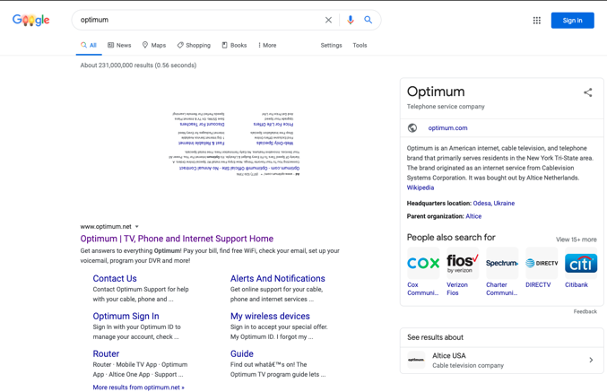
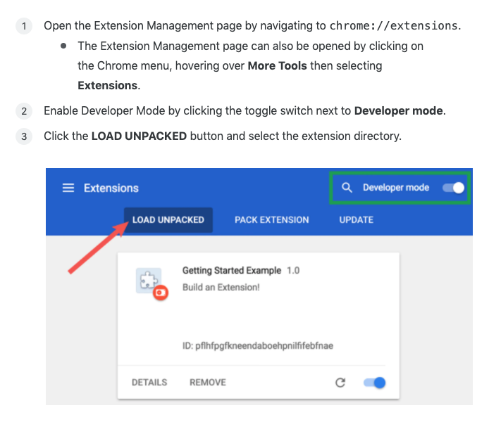

## Unsponsored

A tiny (chrome) browser extension to style sponsored content. 



<br>
Load it as follows:



<br>
Currently handles content on Google, Amazon and Twitter. Additional sites and styling can be added in the `content.js` file, to the `config` array, as follows: 

```
  {
    /* url part to match */
    match: 'amazon', 

    /* dom element query selector */
    domElement: '[data-component-type="s-impression-logger"]',
    
    /* css properties to style matched elements */
    css: {
      transform: "rotateZ(180deg) scale(0.5)",
      transformOrigin: "center center"
    }
  },
```

Feel free to submit PRs to support more websites.